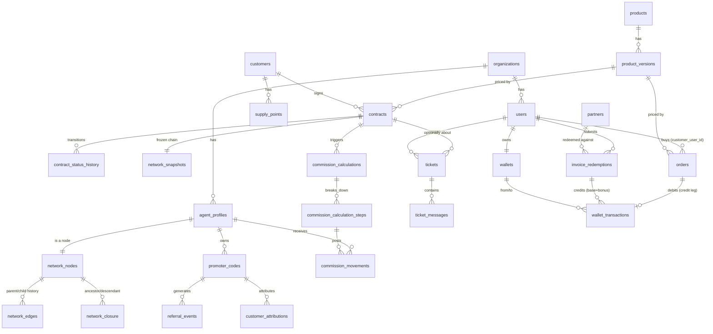

# Database Model

> **Ground truth**: this document explains the *why*. For the exact, current
> column types/constraints/indexes, see `docs/database-schema.sql` — a real
> `pg_dump --schema-only` of the live database, not hand-written. If the two ever
> disagree, trust the SQL dump and fix this file (or the SQLAlchemy models it
> drifted from). See `docs/server-migration-guide.md` for how to regenerate it.

PostgreSQL 16+. All tables carry `id UUID PRIMARY KEY` (generated client-side via
Python's `uuid.uuid4()` at insert time — not a Postgres server-side default),
`created_at TIMESTAMPTZ NOT NULL DEFAULT now()` unless noted. Money columns are
`NUMERIC(14,2)` (EUR) or integer cents (`*_cents BIGINT`) per `business-rules.md §Money`.
Every tenant-scoped table carries `organization_id UUID NOT NULL REFERENCES organizations(id)`.

This document covers the tables implemented through Phase E (the current vertical
slice). Phase F/G tables (`notifications_*`, `knowledge_*`, `ai_*`) are sketched in
`ai-architecture.md` and will be migrated when those phases start.

> **The schema is not the whole story.** After `alembic upgrade head` there are
> 63 tables and no rows — and the application cannot start work without four
> families of reference data (`permissions`, `roles` + `role_permissions`,
> `ranks`, one ACTIVE `commission_plan_versions`) plus a first user. None of it
> is in `database-schema.sql`, which is `--schema-only` by design. What has to
> be there, where it comes from, and how to check it in one query:
> `docs/server-migration-guide.md` §6.1. The command that creates it for a new
> company is `python -m app.seed.bootstrap`.

## 1. Identity & tenancy

```
organizations
  id, name, legal_name, vat_number, status, settings jsonb, created_at

users
  id, organization_id, email (unique per org), password_hash,
  status (ACTIVE/FROZEN -- FROZEN added Session 28, an admin-frozen account
    that can never log in until unfrozen, see business-rules.md#account-freeze),
  email_verified_at, created_at,
  -- account gates, added Session 27 (see business-rules.md#account-gates):
  privacy_accepted_at nullable (set once at self-registration, NULL for
    accounts that predate this field, never backfilled),
  fiscal_code nullable, residence_street/city/province/postal_code nullable,
  residence_country default 'IT' (mandatory profile-completion gate --
    retroactive for every account, unlike email verification above)

roles
  id, organization_id nullable (null = system role), code, name

permissions
  id, code (e.g. "contracts.approve"), description

role_permissions
  role_id, permission_id

user_roles
  user_id, organization_id, role_id

sessions
  id, user_id, refresh_token_hash, user_agent, ip_address,
  created_at, expires_at, revoked_at

password_reset_tokens (added Session 13 -- same shape/reasoning as sessions:
    the opaque random token is only ever handed to the client in the reset
    link, the DB stores just its sha256 hash. Single-use (used_at) and
    time-limited (expires_at, 60 minutes). A successful reset revokes every
    active session for that user -- see auth/service.py::reset_password())
  id, user_id, token_hash, expires_at, used_at nullable, created_at

email_verification_tokens (added Session 27 -- same opaque-token/hashed-at-rest
    shape as password_reset_tokens, 24h expiry, single-use. Sent at
    self-registration only; existing accounts are grandfathered as verified,
    see users.email_verified_at and business-rules.md#account-gates)
  id, user_id, token_hash, expires_at, used_at nullable, created_at

otp_codes (added Session 27 -- short numeric code emailed for a
    self-service action a plain link-click isn't enough proof for; today
    only purpose=PROMOTER_APPLICATION_OTP_PURPOSE ("lavora con noi"),
    10-minute expiry, single-use, `purpose` keeps the table reusable)
  id, user_id, purpose, code_hash, expires_at, used_at nullable, created_at

audit_log (append-only, no updates/deletes)
  id, organization_id, actor_user_id nullable, action, entity_type, entity_id,
  previous_value jsonb, new_value jsonb, reason, ip_address, user_agent,
  correlation_id, created_at
```

## 2. Commercial network

```
agent_profiles
  id, organization_id, user_id nullable (promoters may predate a user account),
  display_name, promoter_code (unique),
  status (ACTIVE/SUSPENDED/TERMINATED/PENDING_APPROVAL -- the last one added
    Session 17: both POST /network/agents (admin, org-wide) and POST
    /network/agents/recruit (a promoter enrolling their own direct
    collaborator) now only SUGGEST a new agent -- created PENDING_APPROVAL,
    unusable as a contract producer (create_contract() already rejects any
    non-ACTIVE producer, so this needed no extra guard) until approved),
  approved_by_user_id nullable, approved_at nullable (added Session 17 --
    who/when a PENDING_APPROVAL agent was approved via PATCH
    /network/agents/{id}/approve, network.approve-gated),
  rejection_reason nullable (added Session 17 -- set by PATCH
    /network/agents/{id}/reject; a rejected agent is TERMINATED with a
    reason kept on the row, never hard-deleted, same append-only-history
    discipline as everywhere else in this project),
  photo_url nullable (added Session 13 -- profile photo, uploaded via
    POST /network/agents/{id}/photo to the public "lial-media" bucket, see
    §6 in server-migration-guide.md and core/storage.py. Same "name
    prominent, id small below" spirit -- a person recognizes a face faster
    than a promoter code),
  first_name, last_name nullable (added Session 20 -- display_name is now
    derived "first last", never edited directly; create_agent()/
    update_agent() take first_name/last_name, not display_name),
  is_blacklisted boolean default false (added Session 20 -- set via the
    admin "Blacklist" action; the ONLY case where self-service "lavora con
    noi" re-application falls back to the old manual PENDING_APPROVAL flow
    instead of auto-activating, see business-rules.md),
  collaboration_contract_version, collaboration_accepted_at,
    collaboration_otp_verified_at, all nullable (added Session 27 -- "lavora
    con noi" now requires accepting a collaboration agreement + typing back
    an emailed OTP before this row's status ever leaves PENDING_APPROVAL/
    becomes ACTIVE, see business-rules.md#account-gates and
    network/service.py::apply_as_promoter),
  joined_at

network_nodes
  id, organization_id, agent_id (unique), direct_parent_agent_id nullable,
  current_rank_id nullable, status, effective_from, effective_to nullable

network_edges                      -- redundant with network_nodes.direct_parent_agent_id
  id, organization_id, parent_agent_id, child_agent_id,        -- but kept as its own
  effective_from, effective_to nullable                        -- append-only history table

network_closure                    -- the query workhorse
  organization_id, ancestor_agent_id, descendant_agent_id, depth,
  effective_from, effective_to nullable
  PRIMARY KEY (organization_id, ancestor_agent_id, descendant_agent_id, effective_from)
  -- reflexive row required: ancestor = descendant, depth = 0
  INDEX (organization_id, ancestor_agent_id)
  INDEX (organization_id, descendant_agent_id)
  INDEX (organization_id, ancestor_agent_id, depth)
  INDEX (organization_id, descendant_agent_id, depth)

network_assignment_history
  id, organization_id, agent_id, old_parent_agent_id, new_parent_agent_id,
  requested_by, approved_by nullable, reason, effective_at, created_at

network_snapshots
  id, organization_id, reason (e.g. "contract_activation"), created_at

network_snapshot_nodes
  snapshot_id, agent_id, ancestor_agent_id, depth, rank_id_at_snapshot
  -- immutable copy of the closure rows relevant to one contract's chain at
  -- activation time; contracts reference network_snapshots.id and never the
  -- live closure table for historical commission calculations

network_change_requests
  id, organization_id, agent_id, requested_new_parent_agent_id, requested_by,
  status (PENDING/APPROVED/REJECTED), reviewed_by nullable, reason, created_at
```

**Session 13 bug fix worth knowing about**: `network/service.py::get_branch()` (the
flat descendant list the promoter tree UI builds itself from) had no `ORDER BY`
and no parent linkage -- the frontend reconstructed the tree by ASSUMING the
rows came back in pre-order traversal order, which Postgres never guarantees
for a plain `WHERE id IN (...)`. Whenever it didn't, most of the tree
silently failed to attach to its real parent, which is exactly what "only see
the first name, opening it shows nothing" looked like from the outside. Fixed
by joining `network_nodes.direct_parent_agent_id` into `BranchMemberRead` as
`parent_agent_id` (null for the branch's own root) and having the frontend
(`branch-visualizer.tsx::buildTree()`) build strictly from that field via a
map, never from row order.

`network_edges` and `network_nodes.direct_parent_agent_id` look redundant; they aren't:
`network_nodes` is the current-state pointer used for writes and simple lookups,
`network_edges` is the append-only history of every parent/child relationship that ever
held, `network_closure` is the derived, denormalized transitive-closure table maintained
transactionally whenever an edge changes. See `adr/0004-closure-table-network.md`.

## 3. Referral / attribution

```
promoter_codes
  id, organization_id, agent_id, code (unique), personal_link, qr_code_url,
  status, valid_from, valid_to nullable

referral_events
  id, organization_id, promoter_code_id, ip_address, user_agent, occurred_at

referral_sessions
  id, organization_id, promoter_code_id, cookie_token (hashed), created_at, expires_at

customer_attributions
  id, organization_id, customer_id, promoter_code_id, referral_session_id nullable,
  attributed_at
  -- These four tables existed since Session 1 but had no live write path other
  -- than the public /r/{code} click-resolver until Session 10 added
  -- POST /auth/register: invite-only self-registration, gated on a valid
  -- promoter_codes.code, writes exactly one customer_attributions row per new
  -- customer in the same transaction as the account itself. No schema change
  -- was needed here -- the tables were simply unused until now.

contract_attributions
  id, organization_id, contract_id, producer_agent_id, attributed_promoter_id,
  network_snapshot_id, created_at

attribution_corrections
  id, organization_id, contract_attribution_id, previous_promoter_id, new_promoter_id,
  requested_by, approved_by nullable, reason, created_at
  -- Existed since Session 1 but, like customer_attributions above, had no
  -- live write path until Session 13 added admin-triggered reassignment:
  -- POST /customers/{id}/reassign-promoter (referral/service.py::
  -- reassign_customer_promoter()). Moves customer_attributions.promoter_code_id
  -- to the new promoter and writes one of these rows as the audit trail of
  -- who requested the move, from which promoter, to which, and why. A
  -- customer is never left without SOME promoter -- reassignment is
  -- rejected if there's no existing attribution to correct.
```

## 4. Catalog, customers, contracts (economics + authorship extended Session 38)

```
products
  id, organization_id, code,
  product_type (ENERGY_CONTRACT/DIGITAL/PHYSICAL/SUBSCRIPTION, default
    ENERGY_CONTRACT -- added Session 10, see below),
  energy_type nullable (ELECTRICITY/GAS/DUAL_FUEL -- only meaningful when
    product_type=ENERGY_CONTRACT; was NOT NULL before Session 10, relaxed
    because a DIGITAL/PHYSICAL/SUBSCRIPTION product has no energy type),
  customer_type (PRIVATE/BUSINESS/BOTH -- REDEFINED Session 38. The column
    existed from the start but nothing ever read it, and its old vocabulary
    (PMI, ENERGY_INTENSIVE, SOLE_PROPRIETOR, CONDOMINIUM) did not line up
    with customers.kind (COMPANY, ...), so the two could never be compared.
    It now holds the binary business answer and IS enforced: a customer is
    only offered -- and only allowed to activate -- contracts their kind
    matches. Legacy values still parse and collapse onto BUSINESS; see
    catalog/pricing.py::normalize_product_customer_type. Migration 0035
    rewrote every existing row to BOTH, deliberately NOT to its literal old
    value: nothing filtered on this column before, so BOTH is the only value
    that leaves the catalog looking identical),
  status,
  category (INTERNAL default/DROPSHIPPING/PARTNER -- added Session 23,
    orthogonal to product_type; see §11)

product_versions
  id, product_id, version_label, base_price_cents, initial_fee_cents,
  recurring_fee_cents, billing_period, tax_configuration jsonb (carries
    vat_percentage as of Session 9 -- pre-existing column, previously unused),
  contract_duration_months nullable (added Session 12 -- contract term length in
    months, e.g. 12 for a standard yearly energy contract; NULL for a one-off
    DIGITAL/PHYSICAL product with no renewal concept. No DB/ORM-level default --
    "12 unless told otherwise" lives only in ProductCreate/ProductVersionCreate,
    so an explicit NULL from the API is never silently coerced to 12. Drives
    contracts.expires_at, see below),
  commission_plan_version_id, required_documents jsonb, terms_version,
  valid_from, valid_to nullable, status,
  credit_discount_percentage (0-100, default 0 -- added Session 23; see §11),
  cashback_enabled (bool, default false -- added Session 33; the opt-in "+5%
    al checkout" cashback, DROPSHIPPING/PARTNER orders only; see §11),
  contract_cashback_percentage (0-100, default 0 -- added Session 38; the
    INTERNAL counterpart of cashback_enabled and a deliberately DIFFERENT
    mechanism: share of a paid contract's GROSS (VAT included) credited back
    as LialCash automatically, with NO surcharge. 0 on every product that
    exists today, so nothing changes until an admin opts in. See
    business-rules.md#cashback-modes),
  first_referrer_bonus_enabled (bool, default false) and
  first_referrer_bonus_cents (default 0) -- added Session 38: a one-off bonus
    for the promoter who ORIGINALLY brought the customer in, additive to the
    recursive commission. Configured here rather than keyed off a price or a
    product id in a controller. INTERNAL only (commissions come from
    contracts); clamped in catalog/service.py. See
    business-rules.md#first-referrer-bonus

customers
  id, organization_id, kind (PRIVATE/SOLE_PROPRIETOR/COMPANY/CONDOMINIUM),
  fiscal_code, vat_number nullable, email, phone,
  pec nullable (added Session 10 -- Italian certified email, distinct from
    the ordinary contact email),
  photo_url nullable (added Session 13 -- same reasoning as
    agent_profiles.photo_url, see §2),
  created_at

customer_profiles
  customer_id, first_name, last_name, date_of_birth

companies
  customer_id, company_name, legal_form, sdi_code

addresses
  id, organization_id, customer_id, kind, street, city, province, postal_code, country

supply_points
  id, organization_id, customer_id,
  label nullable (added Session 12 -- human-readable identifier, e.g.
    "Energia elettrica - Via Roma 12, Milano". POD/PDR codes are correct but
    meaningless to a person scanning a list; auto-computed from energy_type +
    address at creation if not given explicitly, always editable afterwards.
    "Name prominent, id small below" applies to supply points the same way it
    already applied to customers/products/network agents),
  energy_type, pod_code nullable, pdr_code nullable,
  meter_number, supply_address_id, estimated_consumption, actual_consumption,
  provider_reference

contracts
  id, organization_id, customer_id, supply_point_id, product_version_id,
  contract_attribution_id, network_snapshot_id, status,
  notes nullable (added Session 10 -- free-text context set at creation by
    whoever originated the deal, promoter or admin; distinct from
    contract_status_history.notes, which is per-transition, not per-contract),
  activated_at nullable (added Session 12 -- set, and reset on every renewal, by
    transition_contract() whenever the contract enters ACTIVE or RENEWED),
  expires_at nullable, indexed (added Session 12 -- activated_at +
    product_versions.contract_duration_months at that same moment; never
    recomputed retroactively if the product version's duration later changes.
    Powers the admin contract list's expiry column + year filter and the
    promoter's per-contract expiry display),
  iban nullable (added Session 14 -- direct-debit account for the utility's
    recurring charge; basic format check only, `^[A-Z]{2}[0-9A-Z]{13,32}$`,
    not a full mod-97 checksum. Editable by the customer on their own
    contract or by staff on any contract),
  email nullable (added Session 33 -- contact address for THIS pratica,
    deliberately independent of the account's login email),
  holder_first_name, holder_last_name, pec -- all nullable (added Session 49,
    migration 0040 / a7d2e94c3b10 -- the intestatario and PEC as typed into
    the activation wizard, pre-filled from the account and freely editable;
    per contract for the same reason as email/iban. Null on older and
    staff-created contracts),

  -- Who built it (added Session 38). Previously only recoverable indirectly,
  -- from the actor on the first contract_status_history row.
  updated_at nullable,
  created_by_user_id nullable, created_by_role nullable (CUSTOMER/PROMOTER/
    ADMIN, snapshotted from the creator's roles -- a person's roles change,
    what they were acting as here cannot),
  activated_by_promoter_id nullable -> agent_profiles (set ONLY when a
    promoter completed the contract in place of the customer, which is
    exactly when the admin screen should say "Contratto compilato dal
    promoter X". Null when the customer did it themselves or staff created
    it -- never inferred from who earns the commission, which is the same
    promoter in the ordinary case),
  first_referrer_agent_id nullable -> agent_profiles (the promoter who
    ORIGINALLY brought this customer in, resolved from customer_attributions
    at creation and then frozen. Deliberately distinct from
    contract_attributions.producer_agent_id: reassigning the customer later
    changes who earns FUTURE business, not who is owed the bonus on a
    contract already opened),

  -- Economics, frozen at creation (added Session 38). Snapshot, never a live
  -- join to the product version: an admin editing a price or a VAT rate
  -- tomorrow must not restate what somebody already agreed to pay. Computed
  -- exclusively server-side by catalog/pricing.py -- no amount here ever
  -- originates from a browser. See business-rules.md#vat.
  customer_kind nullable (the buyer's kind AS IT WAS -- it is what decided
    whether VAT applies at all, so it is frozen alongside the amounts),
  net_amount_cents, vat_rate NUMERIC(5,2) (percentage points, e.g. 22.00 --
    0.00 for a private customer whatever the product's rate is),
  vat_amount_cents, gross_amount_cents (all nullable: every contract created
    before Session 38 has them NULL and is never back-filled, because
    recomputing from today's product is exactly the retroactive restatement
    the snapshot exists to prevent),

  -- Payment (added Session 38). No contract had ever been paid through this
  -- app when these landed (every production row sat at DRAFT/
  -- DOCUMENTS_PENDING/UNDER_REVIEW), so none of this restates prior
  -- behaviour -- it is the payment step that did not exist. Stripe is the
  -- only proof of payment: a success URL never is.
  payment_plan nullable (FULL = pagamento unico / MONTHLY_12 = dodici rate
    mensili, una vera subscription Stripe / FINANCING = "Finanziaria
    Stripe", importo finanziato e rimborsato al finanziatore, non a noi.
    Nulla scrive ancora questa colonna: lo step di pagamento del contratto
    non è costruito),
  payment_method nullable (CARD/BANK_TRANSFER),
  stripe_checkout_session_id nullable UNIQUE, stripe_customer_id nullable,
  stripe_subscription_id nullable, paid_at nullable,
  cashback_credited_at nullable (the readable exactly-once guard for the
    LialCash credit, on top of the wallet ledger's own unique idempotency
    key -- same belt-and-braces pattern as orders.cashback_credited_at),

  -- Proof of what was accepted (added Session 38). Stored here rather than
  -- read back through the product, so an admin replacing a contract PDF
  -- later cannot change what this customer accepted.
  terms_accepted_at, terms_accepted_by_user_id, terms_version,
  terms_accepted_ip, terms_accepted_user_agent (all nullable),
  created_at

contract_status_history
  id, contract_id, from_status, to_status, actor_user_id, reason, notes,
  correlation_id, created_at

contract_events
  id, contract_id, event_type, payload jsonb, created_at

documents (added Session 14 -- sensitive contract paperwork; see
  security-model.md for the private-storage design this table backs)
  id, organization_id, contract_id,
  document_type (IDENTITY/FISCAL_CODE/UTILITY_BILL/CHAMBER_OF_COMMERCE/OTHER
    -- CHAMBER_OF_COMMERCE required for COMPANY/CONDOMINIUM and merely
    offered to SOLE_PROPRIETOR; OTHER is the open slot for extra
    attachments, added Session 45 -- see business-rules.md),
  description nullable (Session 45 -- what the uploader called an OTHER
    attachment; always NULL for the four fixed types, which are named by
    their type),
  original_filename, storage_key (opaque, unique -- the MinIO object key in
    the private `lial-documents` bucket, never a URL),
  content_type, size_bytes,
  uploaded_by_user_id, uploaded_by_role (snapshot at upload time -- "frozen
    at the moment it happens", same pattern as network_snapshots),
  status (PENDING_REVIEW/APPROVED/REJECTED, indexed), reviewed_by_user_id
    nullable, reviewed_at nullable, review_note nullable,
  created_at
```

Contract `status` is constrained (checked in application code + a Postgres CHECK
constraint) to the state machine in `business-rules.md §Contract state machine`.

contract_commission_plans  (added Session 50, migration 0041 / b3e8f1a6c257)
  id, organization_id, contract_id UNIQUE, accepted_by_user_id -> users,
  accepted_at, payment_plan nullable (known at acceptance, null if unpaid),
  total_commission_cents, preview JSONB (verbatim what the administrator was
  shown), checksum, created_at.
  -- the accepted commission preview, required before first activation;
  -- see business-rules.md#commission-preview

contract_instalments  (added Session 50, same migration)
  id, organization_id, contract_id, number, instalments_total, due_date,
  amount_cents, status (SCHEDULED/PAID/FAILED), paid_at, payment_source
  (STRIPE_CHECKOUT/STRIPE_INVOICE/ADMIN), confirmed_by_user_id -> users,
  stripe_invoice_id nullable, commission_event_id (the one outbox event
  that releases this slice), commission_released_at,
  commission_calculation_id -> commission_calculations, created_at.
  UNIQUE (contract_id, number), UNIQUE (contract_id, stripe_invoice_id)
  (Session 52: was UNIQUE stripe_invoice_id -- one monthly invoice of a
  pratica now pays N contracts).
  -- one row per payment owed; each paid row releases 1/N of the commissions

contract_requests  (added Session 52, migration 0042 / c4f9a2b7d318)
  id, organization_id, customer_id -> customers, status (DRAFT/SUBMITTED/
  CANCELLED), holder_first_name, holder_last_name, email, pec, iban,
  created_by_user_id -> users, created_by_role, activated_by_promoter_id ->
  agent_profiles, submitted_at, cancelled_at, created_at, updated_at.
  -- la pratica di attivazione: N supply points -> N independent contracts,
  -- shared holder/documents/payment; see business-rules.md#contract-request.
  -- Existing contracts backfilled one pratica each, id = the contract's id.

contract_requests -- Session 53 additions (migration 0043 / d5a1b3c9e472)
  street, city, province, postal_code: the address every POD of the pratica
  starts from, asked once with the holder data. Backfilled from each existing
  pratica's first point.

supply_points -- Session 53: energy_type is now nullable (a POD created by
  "quanti POD hai?" is luce or gas only once its package is chosen).

contract_request_checkouts  (added Session 52, same migration)
  id, organization_id, contract_request_id -> contract_requests,
  stripe_checkout_session_id UNIQUE, payment_plan, lines JSONB
  ([{contract_id, gross_cents, instalment_cents}] frozen at creation),
  total_cents, instalment_cents, created_by_user_id -> users, completed_at,
  stripe_subscription_id, stripe_customer_id, outcome, created_at.
  -- one row per Stripe Checkout Session opened for a pratica

contracts -- Session 52 additions
  contract_request_id -> contract_requests NOT NULL (indexed),
  stripe_subscription_item_id UNIQUE nullable (this contract's line in the
  pratica's subscription), billing_stopped_at nullable.
  product_version_id is now nullable, with
  CHECK ck_contracts_product_required: product_version_id IS NOT NULL OR
  status IN ('DRAFT','CANCELLED').

documents -- Session 52 additions
  contract_request_id -> contract_requests nullable (indexed); contract_id is
  now nullable; CHECK ck_documents_one_owner: exactly one of the two is set.

## 5. Commissions (first-referrer bonus added Session 38)

```
ranks
  id, organization_id, code, name, level, personal_token_cents,
  energy_share_percentage, personal_volume_threshold_cents,
  group_volume_threshold_cents, evaluation_window_months,
  single_branch_cap_percentage, valid_from, valid_to nullable, rule_version

agent_rank_history
  id, organization_id, agent_id, rank_id, effective_from, effective_to nullable,
  calculation_source, rule_version_id, approved_by nullable, reason

commission_plan_versions
  id, organization_id, version_label, valid_from, valid_to nullable, status

commission_rule_versions
  id, commission_plan_version_id, rule_type, parameters jsonb, valid_from, valid_to nullable

commission_calculations
  id, organization_id, contract_id, network_snapshot_id, commission_plan_version_id,
  input_snapshot jsonb, output_snapshot jsonb, checksum, status, created_at

commission_calculation_steps
  id, calculation_id, step_order, beneficiary_agent_id, rank_at_calculation,
  base_amount_cents, already_distributed_cents, entrepreneurial_difference_cents,
  personal_bonus_cents, gross_amount_cents, explanation, created_at

commission_movements                                    -- the append-only ledger
  id, organization_id, agent_id, contract_id, origin_event_id, calculation_id,
  movement_type (PERSONAL_TOKEN / ENTREPRENEURIAL_DIFFERENCE /
    FIRST_REFERRER_BONUS -- the last added Session 38: a one-off bonus to
    the promoter who ORIGINALLY brought the customer in, ADDITIVE to the two
    plan movements, never a replacement, and paid to a different agent than
    the producer whenever somebody else assisted that customer),
  amount_cents, currency, status, effective_date, scheduled_date nullable,
  paid_date nullable, rule_version_id, network_snapshot_id, idempotency_key (unique),
  created_at

  -- Note on idempotency_key: every other movement derives it from
  -- (contract, trigger_event, agent, type), because the recursive
  -- commission is earned again on each renewal. FIRST_REFERRER_BONUS
  -- deliberately OMITS the trigger event
  -- ("first-referrer-bonus:{contract}:{agent}"), which makes the UNIQUE
  -- constraint itself the "once per contract, ever" guarantee -- a renewal,
  -- a replayed outbox event or a manual re-run simply cannot produce a
  -- second one.

commission_adjustments / commission_offsets / commission_reversals
  id, organization_id, original_movement_id, new_movement_id, reason, requested_by,
  approved_by nullable, created_at
```

**Automatic monthly rank evaluation (added Session 20)**:
`commissions/services/rank_evaluation.py` writes `agent_rank_history` (and,
through it, `network_nodes.current_rank_id`) on its own schedule, distinct
from every other write path above which only happens as a side effect of a
contract event. Once a month (Celery Beat, day 1 at 02:00 UTC) it recomputes
every ACTIVE agent's personal+group volume for the calendar month that just
closed and re-decides their rank against the `ranks` ladder — promoting or
**demoting** in a single step, with no rolling average. `calculation_source`
is `AUTOMATIC` for the scheduled run and `MANUAL` for an admin-triggered one
(`POST /commissions/rank-evaluation/run`). See `business-rules.md
§Automatic monthly rank evaluation` for the full rationale and
`docs/open-questions.md` for why the thresholds themselves are still
placeholders.

`product_versions.commission_tokens` (jsonb dict, default `{}`, added
Session 20) lets one product override the org-wide
`ranks.personal_token_cents` on a per-rank-code basis (e.g.
`{"S1": 5000}`) for contracts on that product — `run_calculation.py`/
`simulate.py` look up the producing agent's rank code in this dict first,
falling back to the rank's own `personal_token_cents` when the key is
absent.

## 6. Support tickets (added Session 12)

```
tickets
  id, organization_id, opened_by_user_id,
  opened_by_role (CUSTOMER/PROMOTER -- snapshot at creation, not derived from
    the user's current roles at read time; a later role change never rewrites
    who a past ticket "belongs to", same rule as network_snapshots),
  subject, category (ASSISTENZA_TECNICA/FATTURAZIONE/CONTRATTO/COMMISSIONI/ALTRO),
  status (OPEN/IN_PROGRESS/RESOLVED/CLOSED),
  contract_id nullable (optional link so a customer/promoter can open a ticket
    directly "about this contract"),
  created_at

ticket_messages
  id, ticket_id, author_user_id,
  author_role (CUSTOMER/PROMOTER/ADMIN -- snapshot, same reasoning as
    tickets.opened_by_role),
  body, created_at
```

Visibility: a customer or promoter sees only tickets where `opened_by_user_id` is
themselves -- there is no shared inbox between a customer and the promoter who
referred them. Staff (`tickets.respond` permission) sees every ticket in the
organization and can reply to any of them; a staff reply on an `OPEN` ticket
auto-transitions it to `IN_PROGRESS`. New permission codes: `tickets.create`
(open/read/reply to your own tickets -- granted to `CUSTOMER`, `PROMOTER`) and
`tickets.respond` (see/reply to any ticket, change status -- granted to
`ADMIN`-tier roles). See `business-rules.md §Support tickets`.

**Deletion (Session 19):** a `RESOLVED` ticket (and its `ticket_messages`, no
DB-level `ondelete` cascade exists so both are removed explicitly in the
same transaction) can be permanently deleted via `tickets.delete`
(`SUPER_ADMIN`/`ORGANIZATION_ADMIN`/`ADMIN` only -- narrower than
`tickets.respond`, `BACK_OFFICE_OPERATOR` doesn't get it). See
`business-rules.md §Support tickets §Search, filter, and deletion`.

## 7. Notifications (added Session 17)

```
notifications
  id, organization_id, recipient_user_id, created_at,
  type (CONTRACT_CREATED / TICKET_CREATED / PROMOTER_APPROVAL_REQUESTED /
    PROMOTER_APPROVED / PROMOTER_REJECTED / COMMISSION_EARNED /
    RANK_CHANGED / RANK_EVALUATION_COMPLETED -- last two added Session 20,
    fired by commissions/services/rank_evaluation.py: RANK_CHANGED to the
    individual agent being promoted/demoted, RANK_EVALUATION_COMPLETED as a
    roles-fanout summary to staff once a monthly run finishes),
  entity_type, entity_id (what the notification is ABOUT -- e.g. "contract"
    + a contract's uuid -- so the frontend can navigate to it),
  title, body nullable,
  is_read (default false)
```

One row per **recipient user**, not per role or per event -- `notifications/
service.py::notify_roles()` fans a single staff-facing event (new contract,
new ticket, a promoter awaiting approval) out into one row per user holding
one of the target roles at that moment, so read/unread state is tracked
correctly per person even when several admins share a role (one admin
marking a notification read must never silently clear it for a colleague).
`notify_user()` is the single-recipient case (a specific promoter earning a
commission, or being told their suggested collaborator was approved/
rejected). No dedicated permission gates `GET /notifications/mine` -- it is
self-scoped by construction (`recipient_user_id`), same pattern as
`/commissions/mine` and `/network/mine`.

Trigger points (all fire from inside the same DB transaction as the event
itself, via a plain `db.add(...)` -- no commit until the caller's own
commit, same convention as `audit_service.record()`):
`contracts/service.py::create_contract()`, `support/service.py::
create_ticket()`, `network/router.py::create_agent()`/`recruit_agent()`
(both PENDING_APPROVAL creation paths), and
`commissions/services/run_calculation.py::run_calculation_for_contract()`
(one COMMISSION_EARNED notification per beneficiary that has a linked
`user_id`, skipping agents with no login).

The frontend polls `GET /notifications/mine` every 25s (no WebSockets --
not worth the complexity for a low-volume internal tool) and maps each
notification `type` to a sidebar nav item via that item's own
`notificationTypes` array (`app-shell.tsx`), so an unread dot only ever
lights up the ONE nav entry actually relevant to it (e.g.
`PROMOTER_APPROVAL_REQUESTED` only lights up "Anagrafiche Promoter", never
"Tutti i Contratti").

## 8. Documentation / news feed (added Session 20)

```
documentation_posts
  id, organization_id, created_by_user_id,
  title, body nullable (plain text, not HTML/markdown -- rendered with
    whitespace preserved),
  audience (CUSTOMER / PROMOTER / BOTH -- no "internal staff" option, this
    feed is for the two customer-facing roles only),
  status (PUBLISHED / ARCHIVED -- soft-hide, same pattern as
    AgentProfile.status; a real DELETE is a separate, permanent admin action),
  image_url / pdf_url / pdf_filename / video_url, all nullable and
    independent -- a post can be text-only or carry any combination,
  created_at, updated_at
```

Admin-authored posts (announcements, training material) published to one or
both dashboards, gated by `documentation.manage` (same permission tier as
`products.manage`: `SUPER_ADMIN`/`ORGANIZATION_ADMIN`/`ADMIN`). Read-only for
customers/promoters — `documentation-feed.tsx` filters client-side to
`PUBLISHED` posts matching the viewer's own role. Attachments live in the
public `lial-media` bucket (marketing material, not the sensitive-document
workflow in §4/`documents`), uploaded via
`core/storage.py::upload_documentation_attachment()`.

## 9. Internal wallet (added Session 21; extended Sessions 23-24, 33, 37-38)

**"LialCash" (Session 33)**: purely a UI label, not a schema/domain change --
every `wallets`/`wallet_transactions` amount is still `balance_cents`/
`amount_cents` in the same table, same currency (`EUR` string, unchanged).
The dashboard (customer- and admin-facing) formats every wallet balance and
transaction amount with a `LialCash` suffix instead of a euro sign, to keep
it visually distinct from the *real* money columns on `orders` and
`invoice_redemptions` (paid via Stripe or bank transfer, always shown in
actual EUR with the payment method named). See `business-rules.md#internal-wallet`.

```
wallets
  id, organization_id, user_id (unique -- one wallet per login, whether
    CUSTOMER, PROMOTER, or both roles on the same account),
  address (unique, "0x" + 40 hex chars, Ethereum-style -- cosmetic
    resemblance only, no real blockchain involved),
  balance_cents (BigInteger, default 0, CHECK >= 0 -- the first CHECK
    constraint anywhere in this codebase, justified because this is the
    first column that is real financial state rather than an append-only
    ledger total),
  currency (default EUR),
  can_transfer (Boolean, default FALSE -- added Session 23; peer-to-peer
    sending is denied by default for every wallet and enabled individually
    per promoter by an admin, PATCH /wallets/admin/{user_id}/transfer-
    permission. Deliberately per-wallet, not a role grant.)

wallet_transactions                                     -- the ledger
  id, organization_id,
  from_wallet_id nullable (NULL = admin/system origin, i.e. an ADMIN_CREDIT),
  to_wallet_id nullable (NULL = admin/system destination, i.e. a REVERSAL
    of an ADMIN_CREDIT, or a PURCHASE_DEBIT -- CHECK ensures at least one
    side is set),
  amount_cents, currency,
  type (ADMIN_CREDIT / TRANSFER / PURCHASE_DEBIT / REVERSAL --
    PURCHASE_DEBIT added Session 24, the mirror of ADMIN_CREDIT: to_wallet_id
    NULL instead of from_wallet_id NULL, money leaves a wallet to pay for an
    order and ceases to exist),
  source nullable (added Session 23, extended Sessions 33/37/38 --
    MANUAL_ADMIN / WELCOME_BONUS / INVOICE_REDEMPTION_BASE /
    INVOICE_REDEMPTION_BONUS / ORDER_CASHBACK_BASE / ORDER_CASHBACK_BONUS /
    CONTRACT_CASHBACK, a structured tag distinguishing WHY an ADMIN_CREDIT
    row exists without parsing free-text `note`; NULL for
    TRANSFER/PURCHASE_DEBIT/REVERSAL, where `type` alone already says
    enough. CONTRACT_CASHBACK (Session 38) is deliberately its own value
    rather than reusing ORDER_CASHBACK_BASE: three genuinely different
    business rules produce credit here -- the partner-invoice 5%, the order
    opt-in 5%, and the surcharge-free automatic credit on a paid Lial
    Energy contract -- and accounting has to be able to tell them apart at
    a glance. See business-rules.md#cashback-modes),
  reference_contract_id nullable (links a cashback credit to the purchase
    that triggered it -- always NULL for TRANSFER/REVERSAL),
  reference_invoice_redemption_id nullable (added Session 23, FK
    invoice_redemptions.id -- see §11),
  reference_order_id nullable (added Session 24, FK orders.id -- see §12),
  reverses_transaction_id nullable (self-FK, set only on a REVERSAL row --
    the original row is never mutated, same discipline as
    CommissionReversal in §5),
  note nullable, actor_user_id nullable, idempotency_key (unique)
```

ONE ROW per transaction (not double-entry with two rows) -- deliberate,
simpler schema matching the user's own framing ("una tabella globale delle
transazioni... ogni transazione è associato a id cliente e id ricevente").
`Wallet.user_id` is the only ownership key -- not `Customer.id` or
`AgentProfile.id` specifically, since a person may hold both roles on the
same login (see `network/service.py::apply_as_promoter`); the wallet is
created lazily on first access (`wallets/service.py::get_or_create_wallet()`).

**Concurrency**: a debit (peer transfer, or a reversal clawing money back)
uses an atomic compare-and-swap `UPDATE ... WHERE balance_cents >= :amount`
and checks the affected row count -- not `SELECT ... FOR UPDATE`, this
codebase's only other concurrency pattern anywhere being a DB unique
constraint + catching `IntegrityError` (see `commission_movements
.idempotency_key`). `idempotency_key` (client-generated, Stripe-style)
guards against a double-submitted request creating two transactions.

**Reversal**: admin-only (`wallet.manage`, same tier as `SUPER_ADMIN`/
`ORGANIZATION_ADMIN`/`ADMIN` -- not `BACK_OFFICE_OPERATOR`), inserts a new
`REVERSAL` row rather than mutating the original. Reversing a `TRANSFER`
re-debits the original recipient, which can itself fail with
`InsufficientBalanceError` if they've since spent the funds -- an accepted,
documented outcome. Reversing a `PURCHASE_DEBIT` (added Session 24) just
credits the buyer back -- there is no recipient wallet to claw back from,
the mirror-image case `reverse_transaction()` was extended to handle
correctly. A `REVERSAL` itself can never be reversed.

No real-money withdrawal or payment-provider integration exists or is
planned for this domain -- it is a purely internal, virtual balance.

## 10. Partner-invoice cashback: `partners` & `invoice_redemptions` (added Session 23; real payment channel added Session 33)

```
partners
  id, organization_id, name (unique per org),
  logo_url nullable, is_active (default TRUE)

invoice_redemptions
  id, organization_id,
  customer_user_id (FK users.id -- the redeemer, customer or promoter),
  partner_id (FK partners.id),
  storage_key (unique -- private-bucket object key for the uploaded proof of
    payment; deliberately NOT a row in `documents`, whose contract_id is
    NOT NULL by design and has no equivalent here),
  original_filename, content_type, size_bytes,
  declared_amount_cents (what the customer typed in at upload),
  confirmed_amount_cents nullable (what an admin actually verified on the
    document -- this, not the declared figure, drives the payment/credit),
  payment_reference_code nullable, unique (short code generated once
    confirmed_amount_cents is set, e.g. "RIS-8D4384" -- the customer puts it
    in the bank transfer's causale so an admin can match the incoming wire),
  payment_method nullable (BANK_TRANSFER / CARD -- added Session 33, set to
    BANK_TRANSFER the moment verify() opens the payment window, switchable
    to CARD by the customer while still PAYMENT_PENDING; same shape as
    orders.payment_method below),
  stripe_checkout_session_id nullable, unique (added Session 33 -- set once
    a Stripe Checkout Session is created for payment_due_cents(); the
    webhook uses this to confirm CREDITED automatically, exactly like
    orders.stripe_checkout_session_id),
  payment_proof_storage_key/payment_proof_original_filename/
    payment_proof_uploaded_at nullable (added Session 33 -- customer-
    uploaded evidence of the bank-transfer payment, purely advisory, same
    private-bucket-reuse pattern as `storage_key` above and as
    `orders.payment_proof_storage_key`),
  status (SUBMITTED / PAYMENT_PENDING / CREDITED / REJECTED),
  rejection_reason nullable,
  verified_by_user_id/verified_at nullable, credited_by_user_id/credited_at
    nullable (credited_by_user_id stays NULL for a Stripe-confirmed payment
    -- there is no human actor, see invoice_redemptions/service.py::
    mark_paid_via_stripe, same convention as orders.paid_by_user_id)
```

Lifecycle: `SUBMITTED` (uploaded) → `PAYMENT_PENDING` (an admin verified the
real amount and a payment reference code was generated -- one action, not
two separate states) → `CREDITED` (the CASHBACK_PERCENTAGE% payment
arrived, confirmed either by an admin for a bank transfer or automatically
by the Stripe webhook for a card charge -- either way this is the one
moment two `wallet_transactions` rows get written together,
`INVOICE_REDEMPTION_BASE` + `INVOICE_REDEMPTION_BONUS`, never a single
combined row -- see §9 and `invoice_redemptions/service.py::
_credit_redemption()`). `REJECTED` is reachable from `SUBMITTED` or
`PAYMENT_PENDING`. No OCR: the customer types the amount, an admin always
verifies against the document before anything is unlocked -- see
`docs/cashback-partner-invoices-plan.md`.

**Anti-fraud guard (Session 33)**: `confirm_payment()` (the manual "Conferma
bonifico ricevuto" admin action) explicitly refuses a redemption whose
`payment_method` is `CARD` -- only `mark_paid_via_stripe()`, reached
exclusively from the Stripe webhook once Stripe itself confirms the charge,
may credit a CARD redemption. Enforced server-side (`InvalidRedemptionStateError`,
not just a hidden button), the identical rule and reasoning as
`orders/service.py::confirm_payment` refusing a CARD order -- an admin (or
anyone who compromised an admin session) must never be able to mint wallet
credit without Stripe's own confirmation of a real charge.

## 11. Product credit categories & orders (added Sessions 23-24; payment method + self-checkout Session 26; payment proof Session 28ish; product cashback Session 33)

```
products (extended)
  category (INTERNAL default / DROPSHIPPING / PARTNER -- orthogonal to
    product_type, which describes WHAT a product is, not who supplies it or
    how it may be paid)

product_versions (extended)
  credit_discount_percentage (0-100, default 0 -- how much of THIS
    version's price the checkout may let a customer pay from wallet credit
    instead of bank transfer. Enforced server-side to stay 0 whenever the
    parent product's category is INTERNAL, regardless of what's requested --
    catalog/service.py::_clamp_credit_discount() is the single place this
    is enforced, including when a product's category is changed back to
    INTERNAL after having a discount configured, which zeroes it on every
    version in one bulk update.)
  cashback_enabled (Boolean, default false -- added Session 33. Whether the
    checkout may offer "riscuoti subito cashback" on THIS version at all.
    Same INTERNAL-forced-false invariant and same single-enforcement-point
    pattern as credit_discount_percentage above --
    catalog/service.py::_clamp_cashback_enabled().)

orders                                    -- DROPSHIPPING/PARTNER purchases
  id, organization_id,
  customer_user_id (FK users.id -- whose wallet is debited),
  product_version_id (FK product_versions.id),
  created_by_user_id (FK users.id -- an admin, OR the customer themselves
    for a self-checkout order added Session 26 -- POST /orders/mine forces
    this to equal customer_user_id, same rule as wallet transfer's
    from_wallet_id),
  amount_cents (frozen from product_version.base_price_cents at creation --
    same "frozen at the moment it happens" rule as everywhere else),
  credit_applied_cents (default 0, CHECK 0 <= credit_applied_cents <=
    amount_cents),
  credit_debit_transaction_id nullable (FK wallet_transactions.id -- set
    only when credit_applied_cents > 0, points at the PURCHASE_DEBIT row so
    cancelling can reverse that exact row rather than minting a fresh,
    less-traceable refund),
  cashback_requested (Boolean, default false -- added Session 33, "riscuoti
    subito cashback" opted in at checkout; only permitted when the
    product_version has cashback_enabled AND the residual after credit is
    > 0, see orders/service.py::create_order),
  cashback_surcharge_cents (BigInteger, default 0 -- added Session 33,
    ORDER_CASHBACK_PERCENTAGE (5%) of the residual owed in new money,
    frozen at order creation same as amount_cents),
  cashback_credited_at nullable (added Session 33, set once
    _credit_order_cashback() has run for this order -- doubles as the
    idempotency guard against a retried webhook double-crediting),
  status (AWAITING_PAYMENT / PAID / CANCELLED),
  payment_method (BANK_TRANSFER default / CARD -- added Session 26, only
    meaningful when there's a residual to pay; irrelevant and unenforced
    when credit_applied_cents covers 100% of amount_cents),
  stripe_checkout_session_id nullable, unique (added Session 26 -- set once
    a Stripe Checkout Session is created for the residual; overwritten, not
    appended, on a retried checkout attempt, so only the latest attempt is
    ever honored by the webhook),
  payment_proof_storage_key/payment_proof_original_filename/
    payment_proof_uploaded_at nullable -- customer-uploaded evidence of a
    bank-transfer payment already sent, purely advisory (never changes
    `status` by itself), reuses core/storage.py's private documents bucket
    directly under an `order-payment-proofs/{customer_user_id}/` prefix
    (never the `documents` domain, whose contract_id is NOT NULL by
    design).
  note nullable,
  paid_by_user_id/paid_at nullable (paid_by_user_id stays NULL for a
    Stripe-confirmed payment -- there is no human actor, see
    orders/service.py::mark_paid_via_stripe), cancelled_by_user_id/
    cancelled_at/cancellation_reason nullable
```

**"Riscuoti subito cashback" (Session 33)**: when the customer opts in at
checkout (only offerable on a `cashback_enabled` product version), the
residual owed in new money gets a flat `ORDER_CASHBACK_PERCENTAGE` (5%)
surcharge. Once the order reaches `PAID` -- bank transfer admin-confirmed,
or the Stripe webhook -- `orders/service.py::_credit_order_cashback()`
credits the customer's wallet with the base amount actually paid PLUS the
5% bonus, as two separate `wallet_transactions` rows
(`ORDER_CASHBACK_BASE`/`ORDER_CASHBACK_BONUS`, same "never one combined
row" discipline as invoice-redemption credit in §10). **Security
invariant**: the cashback base is always computed from `amount_cents -
credit_applied_cents` -- the actual new money owed AFTER any wallet-credit
discount was already applied, never the pre-discount price -- so a
customer can never manufacture credit by first paying with credit and then
having cashback computed off a higher, unpaid base. Idempotency is a
double guard: the `cashback_credited_at` column on the order, plus
deterministic (non-client-supplied) idempotency keys
(`order:{id}:cashback-base|bonus`) on the two `credit_wallet()` calls.

**Spending existing wallet credit now requires an OTP (Session 33)**: at
self-checkout (`POST /orders/mine`), if `credit_applied_cents > 0` the
request must also carry a fresh `otp_code`, emailed via
`POST /orders/mine/request-credit-otp` (`WALLET_CREDIT_SPEND_OTP_PURPOSE`,
reusing the platform's existing generic OTP infrastructure --
`auth/service.py::request_otp`/`verify_otp`). An admin creating an order on
a customer's behalf (`POST /orders`, `wallet.manage`-gated) is exempt --
the OTP would land in the customer's inbox, not the admin's, and the
action is already permissioned and audited.

Deliberately **not** an extension of `Contract` -- `Contract.supply_point_id`
is NOT NULL by design (every contract is an energy supply), which has no
equivalent for e.g. a partner t-shirt; a new, much simpler domain was the
lower-risk choice, confirmed with the user before building it. If
`credit_applied_cents` covers 100% of `amount_cents` at creation, the order
skips straight to `PAID` -- no bank transfer, no card, no `AWAITING_PAYMENT`
step, `payment_method` is stored but never acted upon. Cancelling an
`AWAITING_PAYMENT` order reverses the exact `credit_debit_transaction_id`
row (see §9's `PURCHASE_DEBIT` reversal) before marking itself `CANCELLED`,
refunding the customer precisely.

**Self-checkout (Session 26)**: `POST /orders/mine`, `GET /orders/mine`,
`GET /orders/quote/mine`, `POST /orders/mine/{id}/checkout-session` are all
open to any authenticated user -- no permission beyond authentication,
`customer_user_id` always the caller's own id. `create_order()` validates
the requested `payment_method` only when a residual exists, and only
accepts one that's actually configured for the organization (see §12) --
`PaymentMethodNotAvailableError` otherwise, which is what makes "the button
doesn't even render if unconfigured" a real guarantee rather than just a
frontend nicety.

## 12. Organization settings (added Session 25; Stripe keys Session 26; admin_notification_email Session 27)

No new table -- `organizations.settings` (JSONB, existed since the original
schema) is now actually read/written through two typed subsets:
`GET`/`PATCH /organizations/me/settings` (`organization.manage` permission
-- SUPER_ADMIN/ORGANIZATION_ADMIN/ADMIN, same tier as `wallet.manage`) holds
`bank_iban`/`bank_account_holder`/`bank_transfer_instructions` (the account
and free-text instructions customers wire bonifico payments to) and
`admin_notification_email` (Session 27 -- where the "new ticket opened"
alert email goes, `organizations/service.py::get_admin_notification_email`,
defaults to `info@lialenergy.it` when unset); `GET`/
`PATCH /organizations/me/payment-settings` (new, stricter
`organization.manage_payments` permission -- **SUPER_ADMIN only**, per the
user's explicit request that whoever configures card payments is a smaller
circle than whoever configures bank transfer) holds
`stripe_publishable_key`/`stripe_secret_key`/`stripe_webhook_secret`. The
two secret Stripe fields are never returned in full by the read endpoint --
only a `*_configured: bool` plus (for the secret key) its last 4 characters,
same principle as a password never round-tripped in plaintext. Both
endpoints merge into the existing dict (`{**org.settings, **updates}`, only
fields actually present in the PATCH), so an unrelated key living in the
same JSONB blob -- or an omitted secret field -- is never clobbered.
`.env`'s `COMPANY_BANK_IBAN`/`COMPANY_BANK_HOLDER` remain a bootstrap
fallback only, read when the DB value is unset; there is no `.env`
fallback for Stripe keys (payment-processing credentials are DB-only,
editable without a server restart).

## 13. ER diagram (core slice)



Full ER diagram will grow as Phase F/G tables land; kept mermaid so it renders directly
wherever this doc is viewed.

## 14. Accounting view (added Session 33)

**No new table.** `GET /accounting/mine` (`accounting/service.py::
list_my_movements`) computes a unified, read-only, newest-first feed of a
user's own financial activity purely by querying two existing sources and
merging them in Python -- deliberately not a materialized/persisted table,
so there is nothing here that can drift from `wallet_transactions`/`orders`,
which remain each domain's own single source of truth:

- Every `wallet_transactions` row touching the caller's own wallet (both
  in/out), formatted as a `"WALLET"` / `"LIALCASH"` movement, signed
  (negative = money left the wallet). Product name resolved via
  `reference_order_id` when set.
- Every one of the caller's own `PAID` `orders` where real money was
  actually charged (`amount_cents - credit_applied_cents +
  cashback_surcharge_cents > 0`), formatted as an `"ORDER_PAYMENT"` /
  `"EUR"` movement carrying `payment_method`. An order fully covered by
  wallet credit produces no row here at all -- that spend is already shown
  as its own `WALLET` row.

This is what the customer-facing "Contabilità" dashboard section renders
(filters by LialCash/Bonifico/Carta, totals, CSV export) -- see
`business-rules.md#internal-wallet`.

Session 54, still no new table: a third real-money source, every `PAID`
`contract_instalments` row as a `"CONTRACT_PAYMENT"` / `"EUR"` movement
(`contract_id`, `contract_request_id`, `payment_method` derived from
`payment_source`); `GET /accounting/mine/summary` (totals, next instalment,
commissions from `commission_movements` for a promoter) and
`GET /accounting/{mine,admin}/detail?ref=` (read-only detail with timeline)
are computed from the existing tables. See
`business-rules.md#accounting-detail`.

## 15. Imported products: the "Acquisti LialEnergy" plugin (added Session 34)

Three tables that are **deliberately a parallel catalog**, not an extension
of `products`/`product_versions`, per an explicit product decision: products
pulled in from an external dropshipping API (AliExpress today) must never be
mixed with the ones Lial Energy curates by hand. Treated as a plugin bolted
onto the existing software rather than a change to it -- nothing in the
`catalog`/`orders` domains was modified to make room for it.

```
import_providers
  id, organization_id, provider_type (ALIEXPRESS), name,
  base_url nullable, api_key nullable (never returned in full by the API --
    schemas mask it to the last 4 characters, same discipline as the Stripe
    secret key in organizations.settings, see §12),
  enabled, created_by_user_id, created_at

imported_products
  id, organization_id, provider_id, external_id nullable, external_url
    nullable, name, description, image_url nullable, price_cents,
  credit_discount_percentage (0-100 -- how much of the price may be paid in
    LialCash; this is the whole point of the category),
  status, created_by_user_id, created_at

  -- There is deliberately NO cashback column of any kind on this table.
  -- These products exist to let a customer SPEND accumulated LialCash, never
  -- to earn more: "non ricaricano cashback". Its absence is the enforcement.

imported_product_orders
  id, organization_id, customer_user_id, imported_product_id,
  created_by_user_id, amount_cents, credit_applied_cents,
  credit_debit_transaction_id nullable -> wallet_transactions,
  status (AWAITING_PAYMENT/PAID/CANCELLED), payment_method
    (BANK_TRANSFER/CARD), stripe_checkout_session_id nullable,
  note, payment_proof_storage_key / _original_filename / _uploaded_at,
  paid_by_user_id / paid_at, cancelled_by_user_id / cancelled_at /
  cancellation_reason, created_at

  -- Mirrors `orders` minus every cashback field, for the same reason.
```

**Separate storage, one continuous experience.** The split exists only to keep
the two product catalogs apart. Everywhere a human looks -- "I miei Ordini",
the admin orders screen, Contabilità -- the two order tables are merged into
one chronological list and behave identically: the same order code derivation
(`id[:8].upper()`), the same statuses, the same payment actions, the same
emails. Which table backs a given order is an internal routing detail (which
endpoint an action calls), never surfaced in the UI, and the customer is never
shown that a product came from AliExpress.

`wallet_transactions.reference_imported_order_id` is the fourth reference
column on the ledger (see §9), kept separate from `reference_order_id` so each
stays a real foreign key to its own table -- a single polymorphic
"order_id + order_type" pair would have given up referential integrity for
cosmetic tidiness.


## 17. Shop Lial Partner: CJ Dropshipping (added Session 60)

A second imported shop, connected for real to CJ Dropshipping's API 2.0. Kept
apart from `imported_products` (§15) for the same reason that table is apart
from `products`, and because a real dropshipping order needs what a
hand-curated one does not: variants, a cost in USD, stock per warehouse, a
shipping quote, a delivery address, and a life on the supplier's side until
delivery. Same customer experience as every shop: LialCash with OTP, bank
transfer or card, "I miei Ordini", Contabilità. Rules:
`business-rules.md#partner-shop`.

```
cj_settings                      one row per organization (UNIQUE organization_id)
  api_key (never returned: only api_key_configured + last 4),
  access_token TEXT, access_token_expires_at, refresh_token TEXT,
  refresh_token_expires_at, open_id (CJ account id, webhook signing secret),
  enabled (shop visible to customers), sandbox (orders sent as isSandbox=1),
  usd_eur_rate NUMERIC(10,6), markup_percentage, markup_fixed_cents,
  price_rounding (90/99/NONE), shipping_mode (CUSTOMER_PAYS/INCLUDED),
  default_credit_percentage, destination_country (IT), auto_forward,
  last_balance_usd, last_balance_at, updated_at

cj_products                      UNIQUE (organization_id, cj_pid)
  cj_pid, cj_sku, name (Italian, editable), name_en (CJ original),
  description (plain text, never HTML), image_url, images JSONB,
  category_name, origin_country (warehouse orders ship from),
  shipping_estimate_usd, shipping_days, status (ACTIVE/INACTIVE),
  credit_discount_percentage, markup_percentage nullable (override),
  last_synced_at, sync_error, created_by_user_id, created_at, updated_at

cj_variants                      UNIQUE (product_id, cj_vid)
  product_id, cj_vid, cj_sku, label, image_url, cost_usd, weight_g,
  price_cents (computed from cost + rules), price_override_cents nullable,
  inventory, active, available_on_cj, last_synced_at, created_at

cj_orders
  customer_user_id, cj_product_id, cj_variant_id, created_by_user_id,
  quantity (> 0), unit_price_cents, shipping_cents, amount_cents,
  credit_applied_cents (0..amount), credit_debit_transaction_id,
  status (AWAITING_PAYMENT/PAID/CANCELLED), payment_method (BANK_TRANSFER/CARD),
  stripe_checkout_session_id UNIQUE, note, payment_proof_*, paid_by/at,
  cancelled_by/at/reason,
  recipient_name, recipient_phone, address_line1/2, city, province,
  postal_code, country_code,
  logistic_name, origin_country, shipping_days,
  unit_cost_usd, shipping_cost_usd, usd_eur_rate   -- frozen at checkout: margin
  fulfillment_status (NOT_SENT/SENDING/SENT/PROCESSING/SHIPPED/DELIVERED/
    ERROR/CJ_CANCELLED, indexed), sandbox, cj_order_id (indexed),
  cj_order_status, cj_amount_usd, forwarded_at, forwarded_by_user_id,
  forward_error, tracking_number, tracking_provider, shipped_at,
  delivered_at, last_cj_sync_at, created_at,
  -- Session 63: the payment to CJ, tracked on its own
  cj_order_code ("SD..."), cj_shipment_order_id, cj_pay_url (CJ's page to pay
  this order), cj_payment_status (NOT_REQUIRED/PENDING/PAYMENT_REQUIRED/PAID/
  FAILED, indexed), cj_product_amount_usd, cj_postage_amount_usd,
  cj_ioss_amount_usd, cj_paid_at, attempt_count, last_attempt_at,
  next_retry_at (indexed), last_error_kind (TEMPORARY/AUTHENTICATION/
  VALIDATION/INSUFFICIENT_BALANCE/FATAL)
```

`wallet_transactions.reference_cj_order_id` (FK `cj_orders.id`) is the fifth
order-like reference on the ledger, a real foreign key like the others (§15).
`status` is the customer's payment, `fulfillment_status` the order on CJ and
the parcel, `cj_payment_status` the payment to CJ: three independent columns
because they are different facts with different owners (the customer, CJ,
the company's cash). An order can wait days as PAYMENT_REQUIRED without being
an error and without looking "in preparation" to the customer.

## 16. "Invita un amico" (added Session 39)

Three tables that are **deliberately a parallel structure**, not an extension
of the commercial network -- see `business-rules.md#friend-referrals` for the
rules. One level, no hierarchy, no commissions.

```
friend_referral_codes
  id, organization_id, user_id (UNIQUE), code (UNIQUE, "INV-XXXXXXXX" --
    codes issued before the Session 39 rename use "SEG-" and keep working,
    since resolution matches the whole code, never the prefix),
  status, created_at

  -- Separate from promoter_codes on purpose. That table means "this agent
  -- earns commissions on what comes through here" and is wired into
  -- attribution, the tree and the commission engine; this one means nothing
  -- more than "this person shared a link". Overloading promoter_codes with
  -- codes that pay nobody would have made every existing query about
  -- promoter codes subtly wrong.

friend_referrals
  id, organization_id, referrer_user_id (index),
  referred_customer_id (UNIQUE -- one person can only ever have been brought
    in by one other), code_used, source (PROMOTER_LINK/FRIEND_LINK),
  created_at

  -- No activated_at column, deliberately: "attivo" is derived from the
  -- referred customer's contracts at read time. A stored flag would need an
  -- event hook on every path that can activate, renew or cancel a contract,
  -- and the first one anybody forgot would leave the count permanently wrong
  -- with nothing to reconcile it against.

friend_referral_reward_claims
  id, organization_id, referrer_user_id (index), milestone (5/10/15...),
  status (REQUESTED/FULFILLED/REJECTED, index), handled_by_user_id,
  handled_at, note, created_at
  UNIQUE (referrer_user_id, milestone)

  -- That UNIQUE is what makes "un omaggio ogni 5" exact: milestone 5 can be
  -- requested once, ever, whatever the count does afterwards. Repeatable at
  -- every multiple of 5, explicitly not only the first. Not an automatic
  -- payout: the gift (today "una gift card da 25 euro", see
  -- friend_referrals/models.py::REWARD_DESCRIPTION) is handed over by a
  -- human, who records what was given in `note`.
```

**This structure never decides who gets paid.** Where an invited customer
lands in the commercial tree is still entirely `referral` + `network`: a
promoter's link puts them in that promoter's tree; a plain customer's link
puts them under that customer's own promoter. There is exactly one
`CustomerAttribution` per registered customer either way, and these three
tables could be dropped without changing a single euro of commission.
