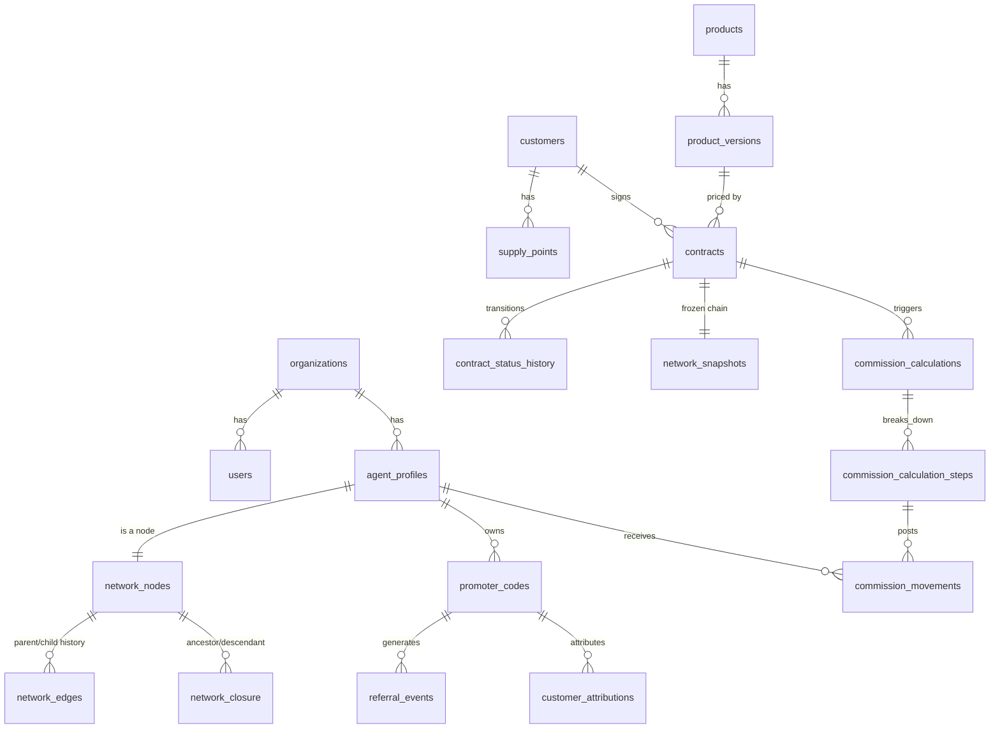

# Database Model

PostgreSQL 16+. All tables carry `id UUID PRIMARY KEY DEFAULT gen_random_uuid()`,
`created_at TIMESTAMPTZ NOT NULL DEFAULT now()` unless noted. Money columns are
`NUMERIC(14,2)` (EUR) or integer cents (`*_cents BIGINT`) per `business-rules.md §Money`.
Every tenant-scoped table carries `organization_id UUID NOT NULL REFERENCES organizations(id)`.

This document covers the tables implemented through Phase E (the current vertical
slice). Phase F/G tables (`notifications_*`, `knowledge_*`, `ai_*`) are sketched in
`ai-architecture.md` and will be migrated when those phases start.

## 1. Identity & tenancy

```
organizations
  id, name, legal_name, vat_number, status, settings jsonb, created_at

users
  id, organization_id, email (unique per org), password_hash, status,
  email_verified_at, created_at

roles
  id, organization_id nullable (null = system role), code, name

permissions
  id, code (e.g. "contracts.approve"), description

role_permissions
  role_id, permission_id

user_roles
  user_id, organization_id, role_id

sessions
  id, user_id, refresh_token_hash, user_agent, ip_address,
  created_at, expires_at, revoked_at

audit_log (append-only, no updates/deletes)
  id, organization_id, actor_user_id nullable, action, entity_type, entity_id,
  previous_value jsonb, new_value jsonb, reason, ip_address, user_agent,
  correlation_id, created_at
```

## 2. Commercial network

```
agent_profiles
  id, organization_id, user_id nullable (promoters may predate a user account),
  display_name, promoter_code (unique), status, joined_at

network_nodes
  id, organization_id, agent_id (unique), direct_parent_agent_id nullable,
  current_rank_id nullable, status, effective_from, effective_to nullable

network_edges                      -- redundant with network_nodes.direct_parent_agent_id
  id, organization_id, parent_agent_id, child_agent_id,        -- but kept as its own
  effective_from, effective_to nullable                        -- append-only history table

network_closure                    -- the query workhorse
  organization_id, ancestor_agent_id, descendant_agent_id, depth,
  effective_from, effective_to nullable
  PRIMARY KEY (organization_id, ancestor_agent_id, descendant_agent_id, effective_from)
  -- reflexive row required: ancestor = descendant, depth = 0
  INDEX (organization_id, ancestor_agent_id)
  INDEX (organization_id, descendant_agent_id)
  INDEX (organization_id, ancestor_agent_id, depth)
  INDEX (organization_id, descendant_agent_id, depth)

network_assignment_history
  id, organization_id, agent_id, old_parent_agent_id, new_parent_agent_id,
  requested_by, approved_by nullable, reason, effective_at, created_at

network_snapshots
  id, organization_id, reason (e.g. "contract_activation"), created_at

network_snapshot_nodes
  snapshot_id, agent_id, ancestor_agent_id, depth, rank_id_at_snapshot
  -- immutable copy of the closure rows relevant to one contract's chain at
  -- activation time; contracts reference network_snapshots.id and never the
  -- live closure table for historical commission calculations

network_change_requests
  id, organization_id, agent_id, requested_new_parent_agent_id, requested_by,
  status (PENDING/APPROVED/REJECTED), reviewed_by nullable, reason, created_at
```

`network_edges` and `network_nodes.direct_parent_agent_id` look redundant; they aren't:
`network_nodes` is the current-state pointer used for writes and simple lookups,
`network_edges` is the append-only history of every parent/child relationship that ever
held, `network_closure` is the derived, denormalized transitive-closure table maintained
transactionally whenever an edge changes. See `adr/0004-closure-table-network.md`.

## 3. Referral / attribution

```
promoter_codes
  id, organization_id, agent_id, code (unique), personal_link, qr_code_url,
  status, valid_from, valid_to nullable

referral_events
  id, organization_id, promoter_code_id, ip_address, user_agent, occurred_at

referral_sessions
  id, organization_id, promoter_code_id, cookie_token (hashed), created_at, expires_at

customer_attributions
  id, organization_id, customer_id, promoter_code_id, referral_session_id nullable,
  attributed_at

contract_attributions
  id, organization_id, contract_id, producer_agent_id, attributed_promoter_id,
  network_snapshot_id, created_at

attribution_corrections
  id, organization_id, contract_attribution_id, previous_promoter_id, new_promoter_id,
  requested_by, approved_by nullable, reason, created_at
```

## 4. Catalog, customers, contracts

```
products
  id, organization_id, code, energy_type (ELECTRICITY/GAS/DUAL), customer_type,
  status

product_versions
  id, product_id, version_label, base_price_cents, initial_fee_cents,
  recurring_fee_cents, billing_period, tax_configuration jsonb,
  commission_plan_version_id, required_documents jsonb, terms_version,
  valid_from, valid_to nullable, status

customers
  id, organization_id, kind (PRIVATE/SOLE_PROPRIETOR/COMPANY/CONDOMINIUM),
  fiscal_code, vat_number nullable, email, phone, created_at

customer_profiles
  customer_id, first_name, last_name, date_of_birth

companies
  customer_id, company_name, legal_form, sdi_code

addresses
  id, organization_id, customer_id, kind, street, city, province, postal_code, country

supply_points
  id, organization_id, customer_id, energy_type, pod_code nullable, pdr_code nullable,
  meter_number, supply_address_id, estimated_consumption, actual_consumption,
  provider_reference

contracts
  id, organization_id, customer_id, supply_point_id, product_version_id,
  contract_attribution_id, network_snapshot_id, status, created_at

contract_status_history
  id, contract_id, from_status, to_status, actor_user_id, reason, notes,
  correlation_id, created_at

contract_events
  id, contract_id, event_type, payload jsonb, created_at
```

Contract `status` is constrained (checked in application code + a Postgres CHECK
constraint) to the state machine in `business-rules.md §Contract state machine`.

## 5. Commissions

```
ranks
  id, organization_id, code, name, level, personal_token_cents,
  energy_share_percentage, personal_volume_threshold_cents,
  group_volume_threshold_cents, evaluation_window_months,
  single_branch_cap_percentage, valid_from, valid_to nullable, rule_version

agent_rank_history
  id, organization_id, agent_id, rank_id, effective_from, effective_to nullable,
  calculation_source, rule_version_id, approved_by nullable, reason

commission_plan_versions
  id, organization_id, version_label, valid_from, valid_to nullable, status

commission_rule_versions
  id, commission_plan_version_id, rule_type, parameters jsonb, valid_from, valid_to nullable

commission_calculations
  id, organization_id, contract_id, network_snapshot_id, commission_plan_version_id,
  input_snapshot jsonb, output_snapshot jsonb, checksum, status, created_at

commission_calculation_steps
  id, calculation_id, step_order, beneficiary_agent_id, rank_at_calculation,
  base_amount_cents, already_distributed_cents, entrepreneurial_difference_cents,
  personal_bonus_cents, gross_amount_cents, explanation, created_at

commission_movements                                    -- the append-only ledger
  id, organization_id, agent_id, contract_id, origin_event_id, calculation_id,
  movement_type, amount_cents, currency, status, effective_date, scheduled_date nullable,
  paid_date nullable, rule_version_id, network_snapshot_id, idempotency_key (unique),
  created_at

commission_adjustments / commission_offsets / commission_reversals
  id, organization_id, original_movement_id, new_movement_id, reason, requested_by,
  approved_by nullable, created_at
```

## 6. ER diagram (core slice)



Full ER diagram will grow as Phase F/G tables land; kept mermaid so it renders directly
wherever this doc is viewed.
