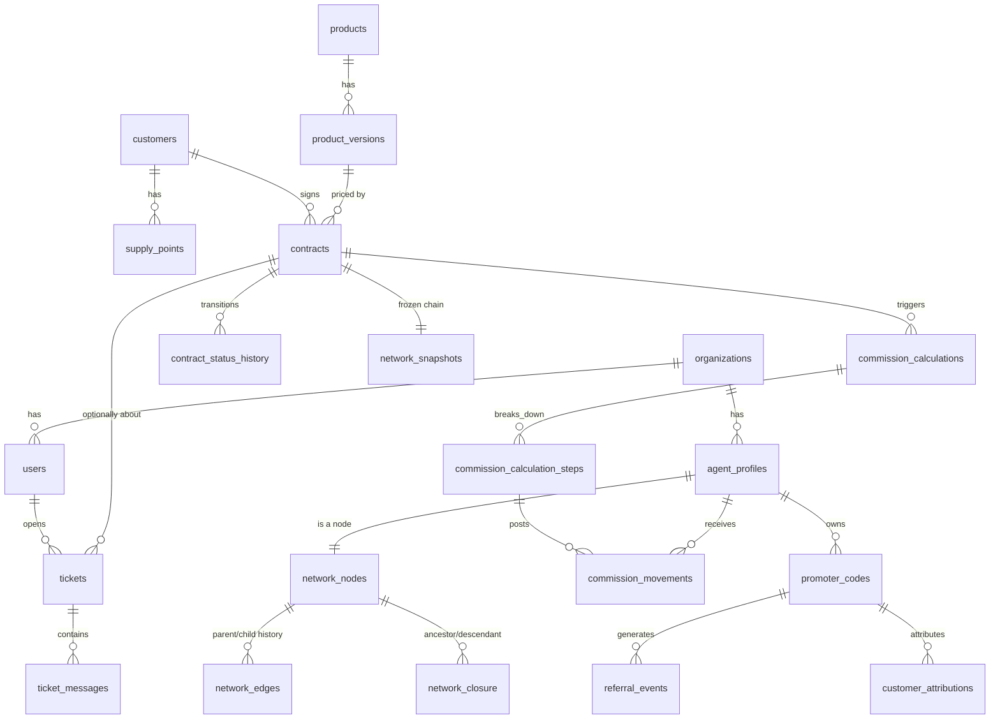

# Database Model

> **Ground truth**: this document explains the *why*. For the exact, current
> column types/constraints/indexes, see `docs/database-schema.sql` — a real
> `pg_dump --schema-only` of the live database, not hand-written. If the two ever
> disagree, trust the SQL dump and fix this file (or the SQLAlchemy models it
> drifted from). See `docs/server-migration-guide.md` for how to regenerate it.

PostgreSQL 16+. All tables carry `id UUID PRIMARY KEY` (generated client-side via
Python's `uuid.uuid4()` at insert time — not a Postgres server-side default),
`created_at TIMESTAMPTZ NOT NULL DEFAULT now()` unless noted. Money columns are
`NUMERIC(14,2)` (EUR) or integer cents (`*_cents BIGINT`) per `business-rules.md §Money`.
Every tenant-scoped table carries `organization_id UUID NOT NULL REFERENCES organizations(id)`.

This document covers the tables implemented through Phase E (the current vertical
slice). Phase F/G tables (`notifications_*`, `knowledge_*`, `ai_*`) are sketched in
`ai-architecture.md` and will be migrated when those phases start.

## 1. Identity & tenancy

```
organizations
  id, name, legal_name, vat_number, status, settings jsonb, created_at

users
  id, organization_id, email (unique per org), password_hash, status,
  email_verified_at, created_at

roles
  id, organization_id nullable (null = system role), code, name

permissions
  id, code (e.g. "contracts.approve"), description

role_permissions
  role_id, permission_id

user_roles
  user_id, organization_id, role_id

sessions
  id, user_id, refresh_token_hash, user_agent, ip_address,
  created_at, expires_at, revoked_at

password_reset_tokens (added Session 13 -- same shape/reasoning as sessions:
    the opaque random token is only ever handed to the client in the reset
    link, the DB stores just its sha256 hash. Single-use (used_at) and
    time-limited (expires_at, 60 minutes). A successful reset revokes every
    active session for that user -- see auth/service.py::reset_password())
  id, user_id, token_hash, expires_at, used_at nullable, created_at

audit_log (append-only, no updates/deletes)
  id, organization_id, actor_user_id nullable, action, entity_type, entity_id,
  previous_value jsonb, new_value jsonb, reason, ip_address, user_agent,
  correlation_id, created_at
```

## 2. Commercial network

```
agent_profiles
  id, organization_id, user_id nullable (promoters may predate a user account),
  display_name, promoter_code (unique), status,
  photo_url nullable (added Session 13 -- profile photo, uploaded via
    POST /network/agents/{id}/photo to the public "lial-media" bucket, see
    §6 in server-migration-guide.md and core/storage.py. Same "name
    prominent, id small below" spirit -- a person recognizes a face faster
    than a promoter code),
  joined_at

network_nodes
  id, organization_id, agent_id (unique), direct_parent_agent_id nullable,
  current_rank_id nullable, status, effective_from, effective_to nullable

network_edges                      -- redundant with network_nodes.direct_parent_agent_id
  id, organization_id, parent_agent_id, child_agent_id,        -- but kept as its own
  effective_from, effective_to nullable                        -- append-only history table

network_closure                    -- the query workhorse
  organization_id, ancestor_agent_id, descendant_agent_id, depth,
  effective_from, effective_to nullable
  PRIMARY KEY (organization_id, ancestor_agent_id, descendant_agent_id, effective_from)
  -- reflexive row required: ancestor = descendant, depth = 0
  INDEX (organization_id, ancestor_agent_id)
  INDEX (organization_id, descendant_agent_id)
  INDEX (organization_id, ancestor_agent_id, depth)
  INDEX (organization_id, descendant_agent_id, depth)

network_assignment_history
  id, organization_id, agent_id, old_parent_agent_id, new_parent_agent_id,
  requested_by, approved_by nullable, reason, effective_at, created_at

network_snapshots
  id, organization_id, reason (e.g. "contract_activation"), created_at

network_snapshot_nodes
  snapshot_id, agent_id, ancestor_agent_id, depth, rank_id_at_snapshot
  -- immutable copy of the closure rows relevant to one contract's chain at
  -- activation time; contracts reference network_snapshots.id and never the
  -- live closure table for historical commission calculations

network_change_requests
  id, organization_id, agent_id, requested_new_parent_agent_id, requested_by,
  status (PENDING/APPROVED/REJECTED), reviewed_by nullable, reason, created_at
```

**Session 13 bug fix worth knowing about**: `network/service.py::get_branch()` (the
flat descendant list the promoter tree UI builds itself from) had no `ORDER BY`
and no parent linkage -- the frontend reconstructed the tree by ASSUMING the
rows came back in pre-order traversal order, which Postgres never guarantees
for a plain `WHERE id IN (...)`. Whenever it didn't, most of the tree
silently failed to attach to its real parent, which is exactly what "only see
the first name, opening it shows nothing" looked like from the outside. Fixed
by joining `network_nodes.direct_parent_agent_id` into `BranchMemberRead` as
`parent_agent_id` (null for the branch's own root) and having the frontend
(`branch-visualizer.tsx::buildTree()`) build strictly from that field via a
map, never from row order.

`network_edges` and `network_nodes.direct_parent_agent_id` look redundant; they aren't:
`network_nodes` is the current-state pointer used for writes and simple lookups,
`network_edges` is the append-only history of every parent/child relationship that ever
held, `network_closure` is the derived, denormalized transitive-closure table maintained
transactionally whenever an edge changes. See `adr/0004-closure-table-network.md`.

## 3. Referral / attribution

```
promoter_codes
  id, organization_id, agent_id, code (unique), personal_link, qr_code_url,
  status, valid_from, valid_to nullable

referral_events
  id, organization_id, promoter_code_id, ip_address, user_agent, occurred_at

referral_sessions
  id, organization_id, promoter_code_id, cookie_token (hashed), created_at, expires_at

customer_attributions
  id, organization_id, customer_id, promoter_code_id, referral_session_id nullable,
  attributed_at
  -- These four tables existed since Session 1 but had no live write path other
  -- than the public /r/{code} click-resolver until Session 10 added
  -- POST /auth/register: invite-only self-registration, gated on a valid
  -- promoter_codes.code, writes exactly one customer_attributions row per new
  -- customer in the same transaction as the account itself. No schema change
  -- was needed here -- the tables were simply unused until now.

contract_attributions
  id, organization_id, contract_id, producer_agent_id, attributed_promoter_id,
  network_snapshot_id, created_at

attribution_corrections
  id, organization_id, contract_attribution_id, previous_promoter_id, new_promoter_id,
  requested_by, approved_by nullable, reason, created_at
  -- Existed since Session 1 but, like customer_attributions above, had no
  -- live write path until Session 13 added admin-triggered reassignment:
  -- POST /customers/{id}/reassign-promoter (referral/service.py::
  -- reassign_customer_promoter()). Moves customer_attributions.promoter_code_id
  -- to the new promoter and writes one of these rows as the audit trail of
  -- who requested the move, from which promoter, to which, and why. A
  -- customer is never left without SOME promoter -- reassignment is
  -- rejected if there's no existing attribution to correct.
```

## 4. Catalog, customers, contracts

```
products
  id, organization_id, code,
  product_type (ENERGY_CONTRACT/DIGITAL/PHYSICAL/SUBSCRIPTION, default
    ENERGY_CONTRACT -- added Session 10, see below),
  energy_type nullable (ELECTRICITY/GAS/DUAL_FUEL -- only meaningful when
    product_type=ENERGY_CONTRACT; was NOT NULL before Session 10, relaxed
    because a DIGITAL/PHYSICAL/SUBSCRIPTION product has no energy type),
  customer_type, status

product_versions
  id, product_id, version_label, base_price_cents, initial_fee_cents,
  recurring_fee_cents, billing_period, tax_configuration jsonb (carries
    vat_percentage as of Session 9 -- pre-existing column, previously unused),
  contract_duration_months nullable (added Session 12 -- contract term length in
    months, e.g. 12 for a standard yearly energy contract; NULL for a one-off
    DIGITAL/PHYSICAL product with no renewal concept. No DB/ORM-level default --
    "12 unless told otherwise" lives only in ProductCreate/ProductVersionCreate,
    so an explicit NULL from the API is never silently coerced to 12. Drives
    contracts.expires_at, see below),
  commission_plan_version_id, required_documents jsonb, terms_version,
  valid_from, valid_to nullable, status

customers
  id, organization_id, kind (PRIVATE/SOLE_PROPRIETOR/COMPANY/CONDOMINIUM),
  fiscal_code, vat_number nullable, email, phone,
  pec nullable (added Session 10 -- Italian certified email, distinct from
    the ordinary contact email),
  photo_url nullable (added Session 13 -- same reasoning as
    agent_profiles.photo_url, see §2),
  created_at

customer_profiles
  customer_id, first_name, last_name, date_of_birth

companies
  customer_id, company_name, legal_form, sdi_code

addresses
  id, organization_id, customer_id, kind, street, city, province, postal_code, country

supply_points
  id, organization_id, customer_id,
  label nullable (added Session 12 -- human-readable identifier, e.g.
    "Energia elettrica - Via Roma 12, Milano". POD/PDR codes are correct but
    meaningless to a person scanning a list; auto-computed from energy_type +
    address at creation if not given explicitly, always editable afterwards.
    "Name prominent, id small below" applies to supply points the same way it
    already applied to customers/products/network agents),
  energy_type, pod_code nullable, pdr_code nullable,
  meter_number, supply_address_id, estimated_consumption, actual_consumption,
  provider_reference

contracts
  id, organization_id, customer_id, supply_point_id, product_version_id,
  contract_attribution_id, network_snapshot_id, status,
  notes nullable (added Session 10 -- free-text context set at creation by
    whoever originated the deal, promoter or admin; distinct from
    contract_status_history.notes, which is per-transition, not per-contract),
  activated_at nullable (added Session 12 -- set, and reset on every renewal, by
    transition_contract() whenever the contract enters ACTIVE or RENEWED),
  expires_at nullable, indexed (added Session 12 -- activated_at +
    product_versions.contract_duration_months at that same moment; never
    recomputed retroactively if the product version's duration later changes.
    Powers the admin contract list's expiry column + year filter and the
    promoter's per-contract expiry display),
  created_at

contract_status_history
  id, contract_id, from_status, to_status, actor_user_id, reason, notes,
  correlation_id, created_at

contract_events
  id, contract_id, event_type, payload jsonb, created_at
```

Contract `status` is constrained (checked in application code + a Postgres CHECK
constraint) to the state machine in `business-rules.md §Contract state machine`.

## 5. Commissions

```
ranks
  id, organization_id, code, name, level, personal_token_cents,
  energy_share_percentage, personal_volume_threshold_cents,
  group_volume_threshold_cents, evaluation_window_months,
  single_branch_cap_percentage, valid_from, valid_to nullable, rule_version

agent_rank_history
  id, organization_id, agent_id, rank_id, effective_from, effective_to nullable,
  calculation_source, rule_version_id, approved_by nullable, reason

commission_plan_versions
  id, organization_id, version_label, valid_from, valid_to nullable, status

commission_rule_versions
  id, commission_plan_version_id, rule_type, parameters jsonb, valid_from, valid_to nullable

commission_calculations
  id, organization_id, contract_id, network_snapshot_id, commission_plan_version_id,
  input_snapshot jsonb, output_snapshot jsonb, checksum, status, created_at

commission_calculation_steps
  id, calculation_id, step_order, beneficiary_agent_id, rank_at_calculation,
  base_amount_cents, already_distributed_cents, entrepreneurial_difference_cents,
  personal_bonus_cents, gross_amount_cents, explanation, created_at

commission_movements                                    -- the append-only ledger
  id, organization_id, agent_id, contract_id, origin_event_id, calculation_id,
  movement_type, amount_cents, currency, status, effective_date, scheduled_date nullable,
  paid_date nullable, rule_version_id, network_snapshot_id, idempotency_key (unique),
  created_at

commission_adjustments / commission_offsets / commission_reversals
  id, organization_id, original_movement_id, new_movement_id, reason, requested_by,
  approved_by nullable, created_at
```

## 6. Support tickets (added Session 12)

```
tickets
  id, organization_id, opened_by_user_id,
  opened_by_role (CUSTOMER/PROMOTER -- snapshot at creation, not derived from
    the user's current roles at read time; a later role change never rewrites
    who a past ticket "belongs to", same rule as network_snapshots),
  subject, category (ASSISTENZA_TECNICA/FATTURAZIONE/CONTRATTO/COMMISSIONI/ALTRO),
  status (OPEN/IN_PROGRESS/RESOLVED/CLOSED),
  contract_id nullable (optional link so a customer/promoter can open a ticket
    directly "about this contract"),
  created_at

ticket_messages
  id, ticket_id, author_user_id,
  author_role (CUSTOMER/PROMOTER/ADMIN -- snapshot, same reasoning as
    tickets.opened_by_role),
  body, created_at
```

Visibility: a customer or promoter sees only tickets where `opened_by_user_id` is
themselves -- there is no shared inbox between a customer and the promoter who
referred them. Staff (`tickets.respond` permission) sees every ticket in the
organization and can reply to any of them; a staff reply on an `OPEN` ticket
auto-transitions it to `IN_PROGRESS`. New permission codes: `tickets.create`
(open/read/reply to your own tickets -- granted to `CUSTOMER`, `PROMOTER`) and
`tickets.respond` (see/reply to any ticket, change status -- granted to
`ADMIN`-tier roles). See `business-rules.md §Support tickets`.

## 7. ER diagram (core slice)



Full ER diagram will grow as Phase F/G tables land; kept mermaid so it renders directly
wherever this doc is viewed.
